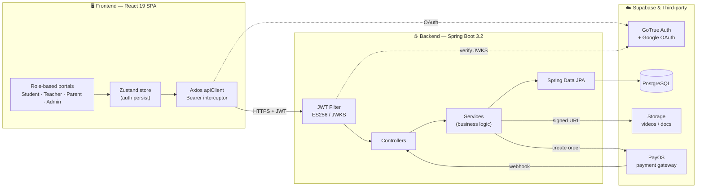

<div align="center">

# 🐝 Bee Academy

**A full-stack e-learning marketplace for Vietnamese middle-school students (grades 6–9).**

Teachers publish and sell video courses · students learn at their own pace · parents track progress · admins moderate & handle payouts.


</div>

---

## 📑 Table of Contents

- [Overview](#-overview)
- [Screenshots](#-screenshots)
- [Key Features](#-key-features)
- [Architecture](#-architecture)
- [Tech Stack](#-tech-stack)
- [Getting Started](#-getting-started)
- [Project Structure](#-project-structure)
- [Testing](#-testing)
- [Roadmap](#-roadmap)
- [Team](#-team)
- [License](#-license)

---

## 📖 Overview

**Bee Academy** is a role-based online course platform where teachers create and sell video courses, students learn at their own pace, parents monitor their children's progress, and admins moderate content and manage payouts.

- **Business model:** one-time course purchase with lifetime access.
- **Payments** flow to the company account through **PayOS**; the system records a **revenue split** per transaction, and admins transfer each teacher's share manually at the end of the period.
- **~48 use cases** across **7 actors** (guest, student, teacher, parent, admin) and 9 functional modules.
- Instead of refunds, the platform uses a structured **complaint workflow** between students/parents and admins.

> 🎯 Built as a capstone-scale group project to practice production-grade patterns: stateless JWT security, third-party payment integration, private media delivery, and role-based access control.

---

## 📸 Screenshots

> _Add your own screenshots/GIFs here — this is the single highest-impact addition for reviewers._

| Landing / Course catalog | Course detail & learning |
|:---:|:---:|
| _`docs/screenshots/landing.png`_ | _`docs/screenshots/course.png`_ |

| Teacher content studio | Admin approval & payouts |
|:---:|:---:|
| _`docs/screenshots/teacher.png`_ | _`docs/screenshots/admin.png`_ |

---

## ✨ Key Features

<table>
<tr>
<td width="50%" valign="top">

### 🎓 Student
- Browse & search published courses; watch **free preview lessons**
- Buy courses via **PayOS** (QR code / bank transfer)
- Stream lecture videos through **signed URLs** (private storage, 1-hour TTL)
- Take chapter **quizzes** and end-of-chapter **exams** with instant grading
- Render **LaTeX math** in lessons and quizzes (KaTeX)
- Profile, avatar, order history, favorites, complaints

</td>
<td width="50%" valign="top">

### 👨‍🏫 Teacher
- Create courses → chapters → lessons; upload videos & documents
- Build a **question bank** (difficulty, usage tracking) + AI scan & Excel import
- Configure per-chapter quizzes and exams
- Submit courses for review (**approve / reject / request revision**)
- Track revenue & payout history; answer student **Q&A**
- Register bank account for payouts

</td>
</tr>
<tr>
<td width="50%" valign="top">

### 👪 Parent
- Link to a child's account via **email invitation** (activates only when accepted)
- Monitor learning progress, quiz scores & payment history
- Message teachers directly; full audit log of link actions

</td>
<td width="50%" valign="top">

### 🛡️ Admin
- Moderate submitted courses with full **approval history**
- Dashboard of held funds & pending payouts
- Export payout lists (Excel) & confirm manual transfers
- Handle student/parent **complaints**; broadcast notifications

</td>
</tr>
</table>

---

## 🏗️ Architecture



**Design highlights**

| Concern | Implementation |
|---|---|
| **Authentication** | Supabase GoTrue — email/password + OTP registration + Google OAuth. JWT verified with **ES256 (ECDSA P-256)** via a JWKS endpoint (HS256 fallback for self-hosted). |
| **Authorization** | Stateless JWT + Spring Security; role-based route guards on both frontend (`ProtectedRoute`) and backend. |
| **Media delivery** | Private Supabase bucket for videos → backend generates **signed URLs (TTL 1h)** so paid content can't be downloaded anonymously. |
| **Payments** | PayOS order creation + **webhook** confirmation with API-verification fallback; a `revenue_split` row is written per paid order. |
| **Quiz integrity** | The full question set + correct answers are snapshotted as **JSONB** when an attempt starts — later edits to the question bank never change an already-submitted attempt. |
| **Race safety** | Unique constraint `(student_id, exam_config_id, attempt_number)` prevents duplicate exam attempts from multi-tab submits. |

---

## 🧰 Tech Stack

**Frontend** — React 19 · Vite 6 · TypeScript 5.8 · React Router v7 · Tailwind CSS v4 (Material Design 3 tokens) · Zustand v5 · Motion (Framer Motion) · Axios · KaTeX · react-hot-toast

**Backend** — Java 21 · Spring Boot 3.2.5 (Web, Data JPA, Security, Validation, Mail) · Hibernate · Maven · Lombok

**Data & Infra** — PostgreSQL via Supabase · Supabase Auth (GoTrue) & Storage · PayOS · SMTP (JavaMailSender)

---

## 🚀 Getting Started

### Prerequisites
- **Java 21** & **Maven**
- **Node.js 20+**
- A [Supabase](https://supabase.com) project (database + auth + storage)
- A [PayOS](https://payos.vn) account (for payment testing)

### 1. Backend

```bash
cd backend
# create backend/.env with the keys below
mvn spring-boot:run          # → http://localhost:8080
```

Required `backend/.env` keys:

```env
SUPABASE_URL=                 SUPABASE_ANON_KEY=
SUPABASE_SERVICE_ROLE_KEY=    SUPABASE_JWT_SECRET=
SUPABASE_DB_HOST=             SUPABASE_DB_PASSWORD=
MAIL_USERNAME=                MAIL_PASSWORD=
CORS_ALLOWED_ORIGINS=http://localhost:3000
DEV_MODE=true
```

Then:
1. Run the SQL migrations in **`backend/db/migrations/`** (`V001` … `V018`, in order) on the Supabase SQL Editor.
2. Create two storage buckets: **`course-videos`** (private) and a public bucket for documents.

### 2. Frontend

```bash
cd frontend
npm install
npm run dev                   # → http://localhost:3000
```

Set `frontend/.env.local`:

```env
VITE_API_URL=http://localhost:8080
```

---

## 📂 Project Structure

```
HocAI/
├── frontend/                     # React 19 + Vite SPA
│   └── src/
│       ├── api/                  # Axios services (auth, course, quiz, complaint…)
│       ├── components/           # Shared UI (ProtectedRoute, Header, Sidebar…)
│       ├── pages/                # common · student · teacher · parent · admin
│       ├── store/                # Zustand stores
│       └── lib/                  # toast wrapper, helpers
└── backend/                      # Spring Boot 3.2 REST API
    ├── src/main/java/com/beeacademy/backend/
    │   ├── controller/           # @RestController endpoints
    │   ├── service/              # Business logic (@Transactional)
    │   ├── repository/           # Spring Data JPA
    │   ├── model/                # JPA entities
    │   ├── dto/{request,response}/
    │   ├── config/               # Security, CORS, JWT, Supabase
    │   └── client/               # Supabase Auth & Storage clients
    └── db/migrations/            # V001…V018 SQL (append-only, run manually)
```

---

## 🧪 Testing

```bash
# Backend
cd backend && mvn test

# Frontend
cd frontend && npm run test:run   # single run
cd frontend && npm run lint       # type-check (tsc --noEmit)
```

Testing priorities: quiz/exam scoring · auth & token refresh · payment callback · route guards · enrollment access checks.

---

## 🗺️ Roadmap

- [x] Auth (email/OTP + Google OAuth), profiles, role-based portals
- [x] Course CRUD, content upload, admin approval workflow
- [x] Question bank, chapter quizzes & end-of-chapter exams (JSONB snapshot grading)
- [x] PayOS checkout + webhook → enrollment
- [x] Parent portal (email-invite linking, progress, messaging)
- [x] Complaints (student/parent ↔ admin) with attachments
- [x] Course reviews & notifications · LaTeX (KaTeX) rendering
- [ ] Teacher dashboard/revenue wired to live API
- [ ] Admin payout export/confirm UI
- [ ] Student assignment-submission UI
- [ ] Certificates (PDF + QR) & AI learning-path chat

---

## 👥 Team

Group project — School of Software Engineering (SWP391).

| Member | GitHub |
|---|---|
| Vo Van Thanh Dat | [@Thanhdat0212](https://github.com/Thanhdat0212) |

---

## 📄 License

Released under the **MIT License** — see [`LICENSE`](LICENSE). Built for educational purposes.
